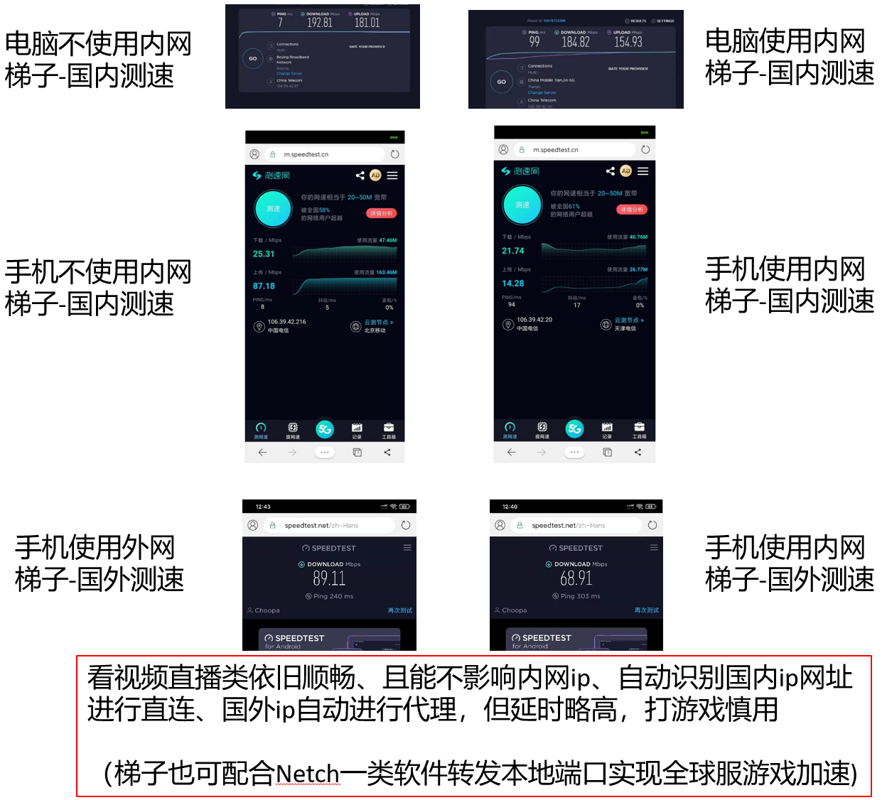

参考

https://toutyrater.github.io/advanced/vps_relay.html

.bak是只内网梯子（建议把block删掉或改direct，block表示局域网不允许访问）

.double是内网kcp梯子+外网中转

.ssdouble是内网ss梯子+外网中转

内网梯子功能：

1. 实现校园网免流量(不论国内外)
2. 搭配外网梯子，实现自动识别国外ip代理上网

性能测评如下图：

