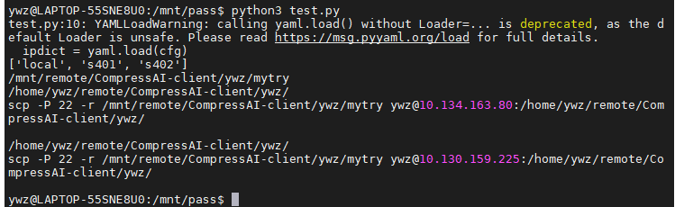

# 实现1->N服务器文件同步、主从服务器群设置

pip install pyyaml

##### 设置服务器间密钥，用于免密认证--可忽略

A向B传

https://www.pianshen.com/article/37241854365/

a. 在A服务器执行ssh-keygen -t rsa,生成配对秘钥，一直enter即可，注意不要输入passphrase（口令）。

b. 再执行以下命令将 id_rsa.pub（公钥）这个文件复制到B服务器用来登录用户的.ssh目录下，并重命名为authorized_keys

scp （-P 端口号）  id_rsa.pub B服务器登录用户名@B服务器IP:~/.ssh/authorized_keys

注意：如果发现B服务器该用户的.ssh目录下已有authorized_keys文件，说明B服务器之前已经和其他服务器建立过信任链接，在此我们不能覆盖该文件，只需要将A服务器的公钥追加到B服务器的authorized_keys即可：

cat id_rsa.pub >>~/.ssh/authorized_keys
多个服务器C\D\E等类似，继续将这个文件cat追加到C\D\E的authorized_keys文件中即可。

## 1. 安装sshpass

sudo apt install sshpass  #中心机安装即可

## 2.单向文件同步 scp+ssh
https://www.cnblogs.com/6b7b5fc3/p/12716237.html

在iplist.yml中配置本机目录和服务器目录对应，同步的当前目录temp是在root基础上的，如果temp==root，设置中将temp赋值处留空即可

python test.py #即为默认全部递归上传一次

python test.py 1 #即为只递归上传.py文件

本代码采用密码写入yml配置方式实现更方便的连接，免去客户端笔记本ip改变后不需要重新导入证书的操作。

## 3. 单向文件同步 rsync+inotify

https://www.cnblogs.com/shengulong/p/6760605.html

待更新，此方法属于增量同步，但需要每个客户端开启服务进行监听，不像前面scp一类比较简单粗暴
但inotify可以用于监听变化文件，配合ssh同步属于一种折中处理。

# 补充
windows主机可以通过应用商店安装wsl子系统，进入后安装ssh实现同样的功能，win下的目录会自动挂载到/mnt/c,d,e盘下

如果遇到ssh无法开启情况，可以尝试 sudo ssh-keygen -A

