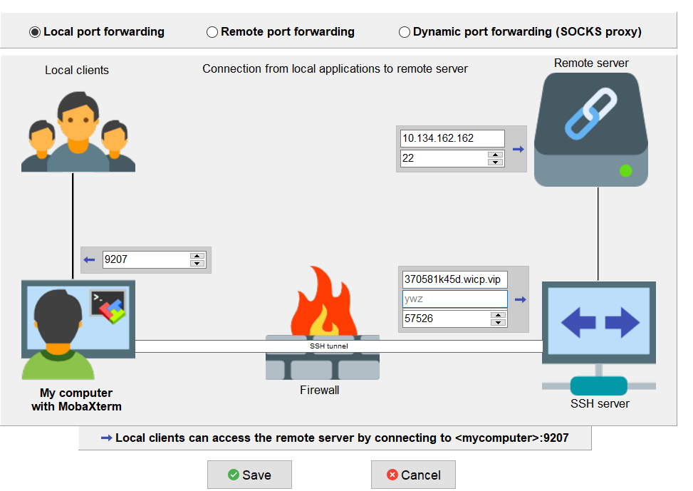

# 跳板机之便捷管理所有远程内网机器-ssh&scp

## 1. vscode版配置
见[config](./config)，将vscode的远程配置进行参考修改，再远程即可  

## 2. 类linux-命令行版配置, 支持多级跳转(默认一级) -- 多机器推荐
见[env.sh](./env.sh)  
兼容IPAD/IOS-iSH软件(Alphine系统)，安卓-AidLux/Termux，以及WIN-WSL，MACOS等  
具体ip请根据各自情况修改配置，建议看env.sh注释  
使用实例  
```
#建议看env.sh代码及注释
#1.初始化配置(必须)
. env.sh        #使用默认1号跳板机
. env.sh 3      #使用3号跳板机
. env.sh nojump #不使用跳板机，如已经在内网中/需要多级跳板可使用此项

#2.直接连接跳板机本身(可选)
j2      #ssh连接2号跳板机
s220    #ssh连接到本身可公网直连的服务器

#3.连接内网机器(可选)
s518    #第一步中选择的跳板机/无跳板机进行内网机器ssh连接
### 多级跳板ssh[注意规则]-无视默认选择
ssh ywz@$ip518 -J $jump1,$jump2,$jump3 #跳板顺序为: jump1->jump2->jump3->ip518

#4.映射内网机器端口(可选)
# mapping函数主要用来端口映射，方便scp/sftp/打开浏览器查看面板等高级操作 搭配本机ip固定127.0.0.1进一步使用
mapping $ip518 22 9050 #将内网机器的22端口(默认ssh端口) 映射到本机的9050端口，使用默认跳板机
### 多级跳板后映射机器端口[注意规则]-无视默认选择，但至少输入一个跳板机
mapping $ip518 22 9050 $jump1 $jump2 $jump3 #端口映射多级跳转规则, jump1->jump2->jump3->ip518

#5.查看配置的内网机器ip(可选)
echo $ip518

#6.查看使用说明(可选)
help
```

## 3. mobaxterm-配置-仅限win用户
### 3.1端口映射  
<br>  
原理参考env.sh中端口映射mapping函数，改为图形化操作：将本地端口映射到远程内网机ip+端口  

### 3.2跳板机代理ssh  
原理参考env.sh中跳板机代理ssh，改为图形化操作：编辑Session-正常填写host和用户名、端口(默认22). 填写完成后再填写跳板机配置: 下方Network Settings-Connect through ssh gateway-填入跳板机ssh映射的公网ip和端口号以及跳板机的随意一个账号即可

<br>
<br>
<br>
<br>


# [多开发/执行机器协同开发git管理参考](../中心化多机器开发推荐配置.md)