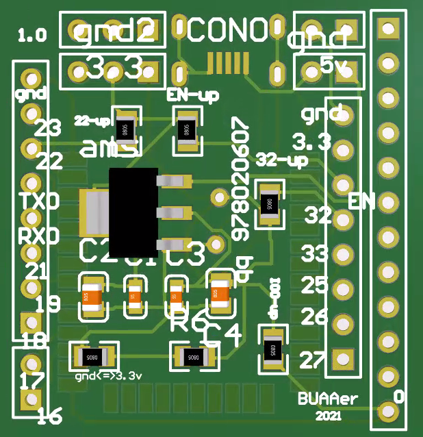

# esp32-S模组底座

3cm*3cm大小，小体积嵌入，右侧提供一排空针孔，同时对IO0\22\EN\32做了上拉处理

兼容不同电平输入

此处5V如果接USB等，焊接AMS1117-3.3比较稳

若接3.7V~4.2V锂电池，则换用[TC1262](https://www.dgzj.com/dianzi/96906.html)芯片，同时依旧可以用5V输入

封装均为SO-T223

效果图:

