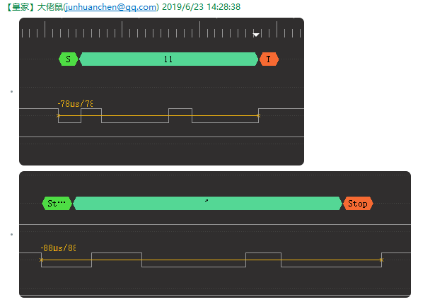
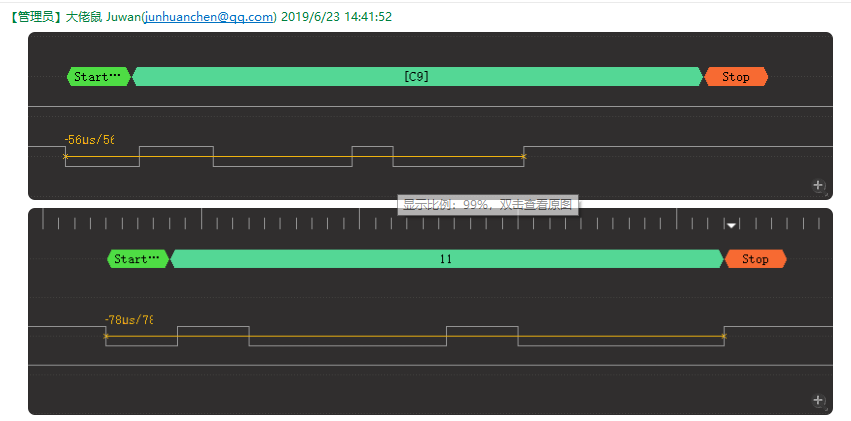
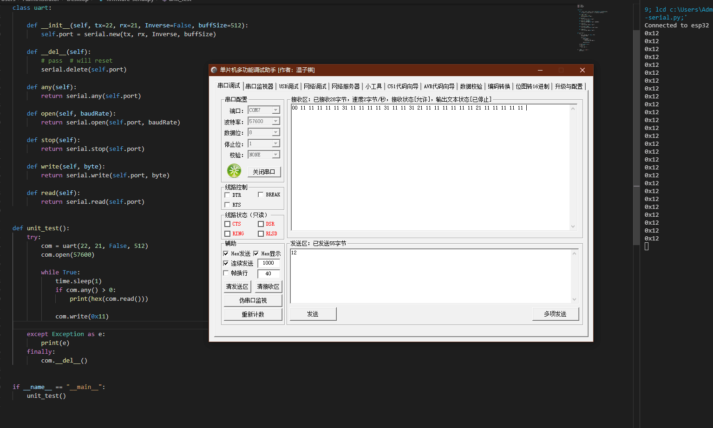

# ESP-IDF SoftWare Serial

Github Arduino [Esp32-SoftwareSerial](https://github.com/junhuanchen/Esp32-SoftwareSerial)

花了点时间写了一下软串口，因为娱乐和工程需要，所以我从过去自己在 Arduino 上实现的软串口移植到 ESP-IDF 下，为此也写一周了吧，使用硬件为 Bpi：Uno （esp32）。

## 本模块的意义是？

大多数传感器接口，会采用 9600 的通信协议，而 ESP32 的硬串口很少（其中一个无法进行发送数据），举例来说，如果我们想要集成了 GRPS 模块、RS232 模块、MicroPython REPL、XX 串口传感器的模块，此时怎样都不够用，所以软串口可以解决此问题。

## 注意不能使用的引脚

在 arduino 里有这样的定义，NULL 的意味着它无法作为接收引脚，其他的一般都可以作为发送引脚，注意别和硬串口冲突（比如 0 2 16 17 ），不然就是浪费了。

```c++

static void (*ISRList[MAX_PIN + 1])() = {
    sws_isr_0,
    NULL,
    sws_isr_2,
    NULL,
    sws_isr_4,
    sws_isr_5,
    NULL,
    NULL,
    NULL,
    NULL,
    NULL,
    NULL,
    sws_isr_12,
    sws_isr_13,
    sws_isr_14,
    sws_isr_15,
    sws_isr_16,
    sws_isr_17,
    sws_isr_18,
    sws_isr_19,
    NULL,
    sws_isr_21,
    sws_isr_22,
    sws_isr_23,
    NULL,
    sws_isr_25,
    sws_isr_26,
    sws_isr_27,
    NULL,
    NULL,
    NULL,
    NULL,
    sws_isr_32,
    sws_isr_33,
    sws_isr_34,
    sws_isr_35};

```

## Unit Test

- 9600 在 ESP-IDF 和 MicroPython 环境下测试完美，其中 0x00 - 0xFF 256 个字节的数据发送与接收均正常，多次测试的结果非常好。
- 57600 在 ESP-IDF 环境下测试和 9600 的效果一致，但是 MicroPython 中多次发送数据后，数据会抖动，需要优化一下每个字节的发送部分的间隔才能改善，另外 0x00 - 0xFF 256 个字节的数据接收正常。
- 115200 在 ESP-IDF 环境下测试收发通信正常，但是在 MicroPython 下无法正常，轻微的 4us 误差数据抖动，就会导致每次采集数据不准确，也没有对此添加过采样（多次采样选其一），所以需要设定波特率到 136000 才能相对准确（更快的发送，从而忽略掉两次执行发送间隔的影响，这个部分我想在还需要多加优化才能相对完美）。

所以 esp-idf 中，你可以任意使用 9600 57600 115200 的波特率，但如果发现存在问题，需要去修改 sw_serial.h 中的两个参数 rx_start_time 和 rx_end_time ，或设置其他波特率。

```c++

// suggest max datalen <= 256 and baudRate <= 115200
esp_err_t sw_open(SwSerial *self, uint32_t baudRate)
{
    // The oscilloscope told me
    self->bitTime = (esp_clk_cpu_freq() / baudRate);

    // Rx bit Timing Settings
    switch (baudRate)
    {
        case 115200:
            self->rx_start_time = (self->bitTime / 256);
            self->rx_end_time = (self->bitTime * 127 / 256);
            break;
        
        case 9600:
            self->rx_start_time = (self->bitTime / 9);
            self->rx_end_time = (self->bitTime * 8 / 9);
            break;
        
        default: // tested 57600 len 256
            self->rx_start_time = (self->bitTime / 9);
            self->rx_end_time = (self->bitTime * 8 / 9);
            break;
    }
    
    // printf("sw_open %u %d\n", self->rx_start_time, self->rx_end_time);

    sw_write(self, 0x00); // Initialization uart link

    return sw_enableRx(self, true);
}

```

而 micropython 中，不超过 57600 都是可以正常使用的，但 115200 只能靠改参数来满足，比如 115200 改成 137000 可以让局部数据准确传输，通常我们认为完整的数据范围是 0x00 - 0xFF 之间。

## DSView Tool

对于其中的数据传输情况，你需要一个逻辑分析仪，例如我使用的是这个 [dreamsourcelab](https://www.dreamsourcelab.com/) 。

比如我下图做的分析。





## MicroPyhton 的效果



## harvest

首先我学会了使用逻辑分析仪 ：)，我可以自己去捕获数据的情况来分析数据源，分析它的发送和接收都是相对麻烦的事情，但从编程上讲，一定是发送要比接收更简单。

### how to do

首先我最早在 Arduino 上使用软串口，作为软件出身的，我知道如何进行逻辑分析和拆解，因此我从 Arduino 上分离了逻辑到 ESP-IDF ，但是当我移植完成后完全不能使用，因为这个不同于软件模块，迁移之后只需要关系逻辑问题，这个还要结合通信时序来分析问题。

因此，我移植完成后，先审核数据发送接口的逻辑，最先遇到的问题的是 主频 和 时间周期的关系，经过群里小伙伴的教育后，我才知道 波特率 以及主频频率的意义，所谓的 115200 波特率是指 1 * 1000 * 1000 us 下的 bit 数量（可能描述不准确，主要就是量化 bit 的传输周期），因此在 1 秒下 115200 波特率的 bit 周期为 8 us ， 结合标准的传输内容 起始位 数据位 停止位，总共 10 个 bit ，也就是 80 us 一个字节，因此 115200 下传输一个字节需要 80 us 左右。

基于此继续说，所以发送的时候，假设为上升沿触发后，将会持续 80us 的过程进行字节判定，对方将会捕获此数据进行协议解析，而没有逻辑分析仪，你就无法准确判断，怎么才是正确的数据。

所以我从师弟手上抢掠了一台萝莉分析仪，先是捕获 CH340 的发送数据，以确保标准发送的数据源，再结合自己产生的数据做比较，结果才发现，发送的逻辑结构是一样的，但周期间隔完全不一样，因此假设逻辑已经正确，消除时序的周期差异，只需要解决差异的倍数就可以了，所以回到 主频 和 时间的关系，例如 esp32 160 的时候此时 芯片的 1 us 差应该如何获得，为了能够创造这个 1 us 的关系，实际上就是假设为单周期的计数器的结果，所以我们可以假设 160 次累加后相当于 1 us，所以 8u 就是放大 8 * 160 的结果，有了这个基准，就可以准确的进行每次数据的发送间隔，在代码中的 WaitBitTime 和 getCycleCount 就是做这个用途的。

有了周期的基准，也有了逻辑结构，程序的功能已经成型，那么就是核对测试的问题。

本以为有了这一切都已经可以正常发送数据了后。

结果发现硬件存在一点差异化问题，不知为何，第一个字节发送的一定会错误，因为分析仪得到的数据中有一个极小的抖动，突然向下跳了一下，导致后续数据混乱，所以先发一个数据，清理掉这个不知道是不是上电带来的影响（软解），此后数据一切正常。

接着测试发送 0x00 - 0xFF 的定义域数据，核对边界，切换 9600 、57600、115200 进行核对，期间没有什么异常。

进入到接收部分开发，中断触发已经确认，但发现，此时逻辑分析仪已经无法派上用场了，因为解析全指望芯片的寄存器和中断函数不出问题，处理这部分的时候，幸运的结合了 Arduino 的经验，假设数据源为 CH340 ，选择起始位的上升沿的 1 / 9 区域作为捕获上升沿信号的采样（没有过采样），此后依次采样，然后 停止位的时候 8 / 9 的区域收尾停止位 bit ，此时一帧完成。

这个逻辑在 9600 和 57600 的时候没有出现太大问题，当 115200 出现后，1 / 9 的比例无法保障 256 字节数据传输过程中的执行误差。（还是因为没有过采样XD），所以 115200 的时候，出现了接收错误，没有办法使用逻辑分析仪，结合代码逻辑，尽量优化中断函数的操作，然后确保每次中断函数的独占和退出都最小化影响，并调整到 1 / 256 的区间，此时 256 定义域字节数据一切正常，测试完成。

ESP-IDF 开发完成，移植到 MicroPyton 存在的问题。

主要是发送数据的函数间隔和接收数据的其他函数影响，总体来讲。

发送函数在 Python 环境中，所以 115200 的时候，数据位的发送过程中与 标准源的误差去到了 4us ，这意味着可能错过半个位，因此可以通过设置较高的波特率调快发送的位等待（bit wait time），但接收函数就无法保证了，所以 115200 还存在一些需要深度优化的才能解决的细节问题（比如过采样XD，也需要测试一下 ESP32 的 IO 翻转速度）。

## problem

目前是半双工的软串口，所以你需要一个 CH340 之类的做数据收发测试，注意发送的数据，不能乱发，容易让电脑蓝屏（使用的时候尽量是 ASCII）。

MicroPython 暂时无法使用 115200 的波特率，但你如果是指定的某些数据协议，还是可以通过修改源码的时序尽可能解决的，但这个做法并不通用。

还需要更长的数据和更大量的数据传输来测试，否则也只是消费级的娱乐代码水准。

## result

最后 萝莉分析仪真是个好东西，还有我的空气果可以搬到 MicroPython 上了，来一张全家桶合照。


